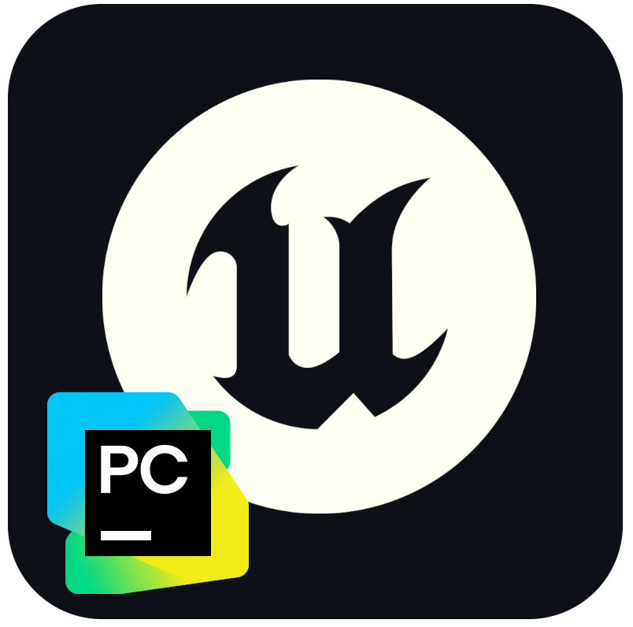
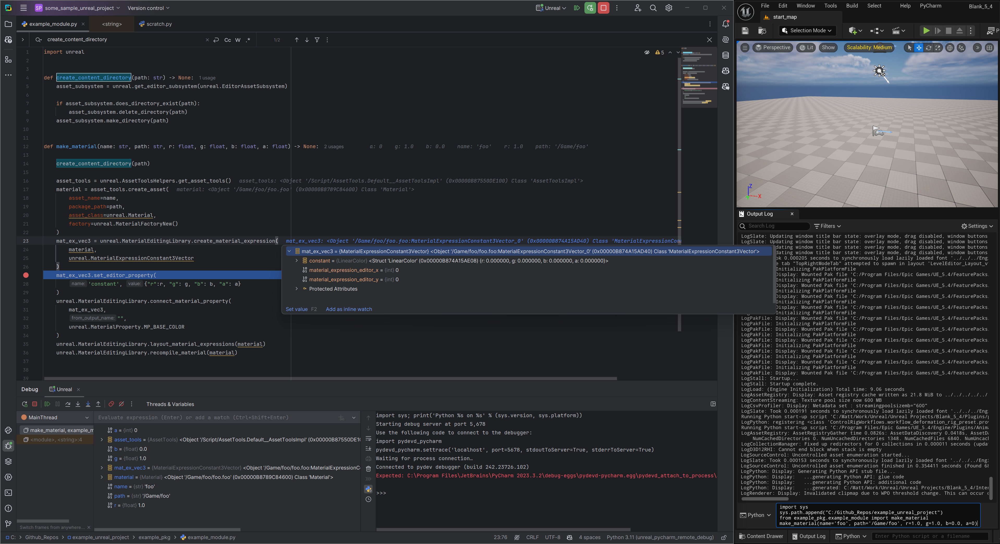
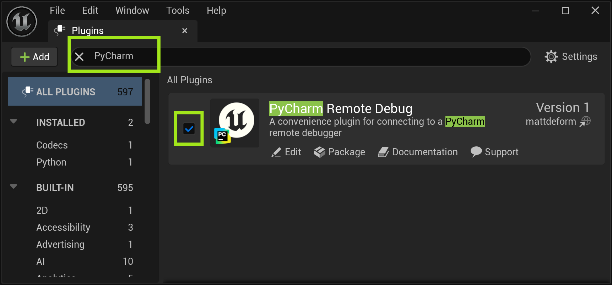
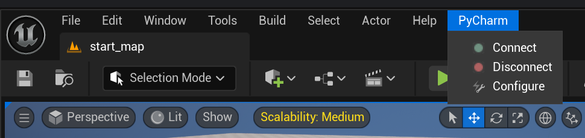
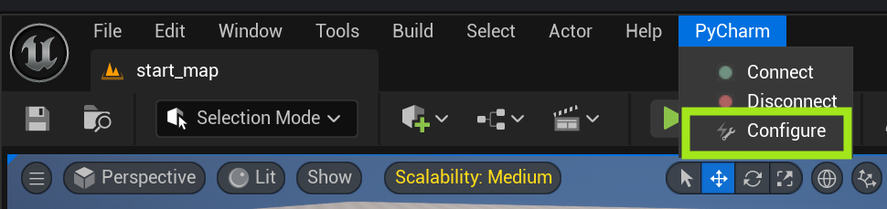
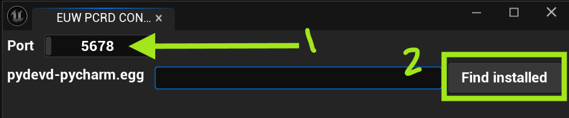
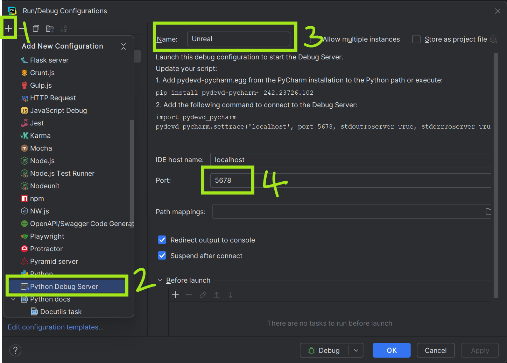
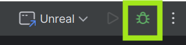
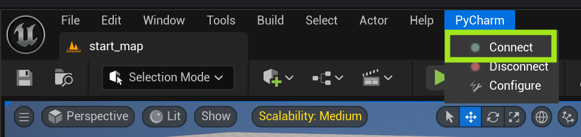
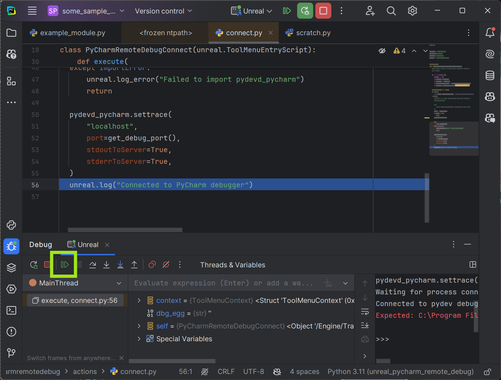

<!-- PROJECT SHIELDS -->

<!-- PROJECT LOGO -->
 
  

<h3 align="center">Unreal PyCharm Remote Debug Support</h3>

  

    <a href="https://www.youtube.com/watch?v=wymW7qOSqiw">View Demo</a>
    ·
    <a href="https://github.com/mattdeform/UnrealPyCharmRemoteDebug/issues/new?labels=bug&template=bug-report---.md">Report Bug</a>
    ·
    <a href="https://github.com/mattdeform/UnrealPyCharmRemoteDebug/issues/new?labels=enhancement&template=feature-request---.md">Request Feature</a>
  

<!-- TABLE OF CONTENTS -->

  
Table of Contents

  <ol>
    <li>
      <a href="#about-the-project">About The Project</a>
    </li>
    <li>
      <a href="#getting-started">Getting Started</a>
      <ul>
        <li><a href="#prerequisites">Prerequisites</a></li>
        <li><a href="#installation">Installation</a></li>
        <li><a href="#usage">Usage</a></li>
      </ul>
    </li>
    <li><a href="#roadmap">Roadmap</a></li>
    <li><a href="#contact">Contact</a></li>
  </ol>

<!-- ABOUT THE PROJECT -->
## About The Project
> __This is NOT an official JetBrains or Epic Games plugin and requires PyCharm Professional.__

    

(<a href="#readme-top">back to top</a>)

<!-- GETTING STARTED -->
## Getting Started

### Prerequisites

* [Unreal Engine 5](https://www.unrealengine.com)
* [PyCharm Professional](https://www.jetbrains.com/pycharm/buy/)

(<a href="#readme-top">back to top</a>)

### Installation
1. [Download and add the plugin](https://www.fab.com/listings/e85a1294-3781-4672-a660-5b92a534e463) to your library.
2. Enable the Plugin in the Unreal "Plugin Settings" menu, and restart the editor.
    - 
3. In the level editor you should have a new menu named "PyCharm".
    - 

(<a href="#readme-top">back to top</a>)

<!-- USAGE EXAMPLES -->
### Usage

1. You can configure port number and debug egg file location (comes with PyCharm installation) by clicking on the PyCharm -> Configure menu. 
   - 
2. Select desired port number, and click "Find installed" to find the systems installed PyCharm. Alternatively you can manually enter a path to a desired pydevd-pycharm.egg file.
   - 
3. In PyCharm, create a new Python Debug Server named ___Unreal___, with the port number set in the previous step.
   - 
4. In PyCharm click the Unreal debug icon.
   - 
5. From the level editor click PyCharm -> Connect. <i>This will freeze your Unreal session until the next step (or timeout)</i> 
   - 
6. Switch back over to PyCharm and click "Resume Program" or press F9 
   - 
    
PyCharm is now connected to Unreal, you can set break points in your code and interactively debug your Python tools at runtime, enjoy!

> Note: Sometimes remote debug sessions can hang or become unstable. If this happens you can simply click the "Disconnect" button in Unreal and then start from step 4 again.
    

(<a href="#readme-top">back to top</a>)

<!-- ROADMAP -->
## Roadmap

See the [open issues](https://github.com/mattdeform/UnrealPyCharmRemoteDebug/issues) for a full list of proposed features (and known issues).

(<a href="#readme-top">back to top</a>)

<!-- CONTACT -->
## Contact

Please reach out via the [request a feature](https://github.com/mattdeform/UnrealPyCharmRemoteDebug/issues/new?labels=enhancement&template=feature-request---.md) or [report a bug](https://github.com/mattdeform/UnrealPyCharmRemoteDebug/issues/new?labels=bug&template=bug-report---.md) pages.

(<a href="#readme-top">back to top</a>)
